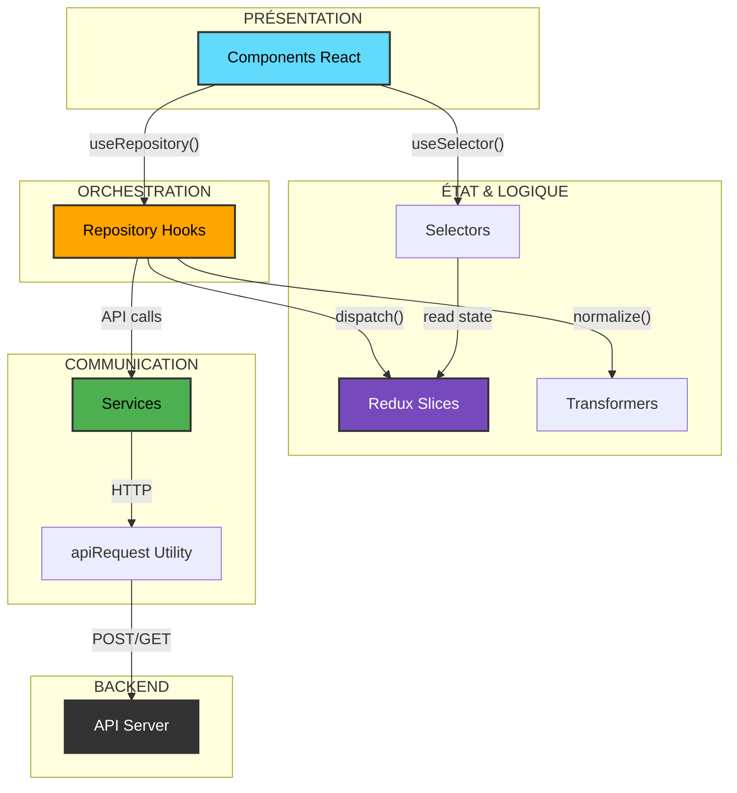
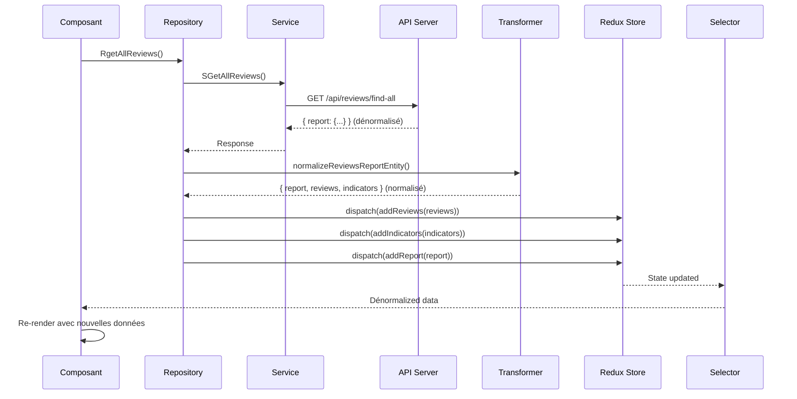
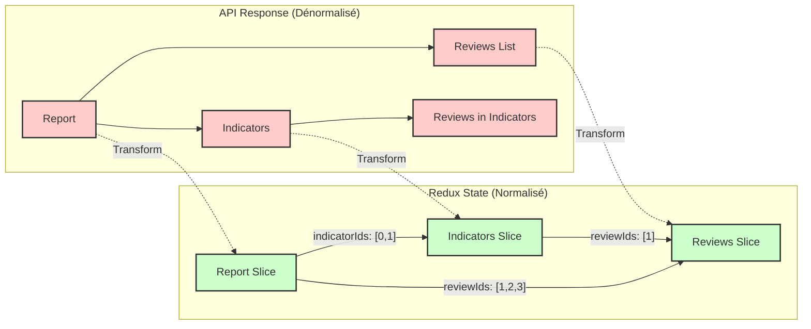
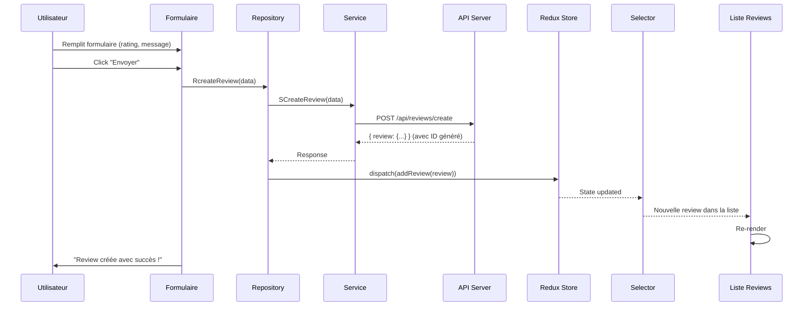
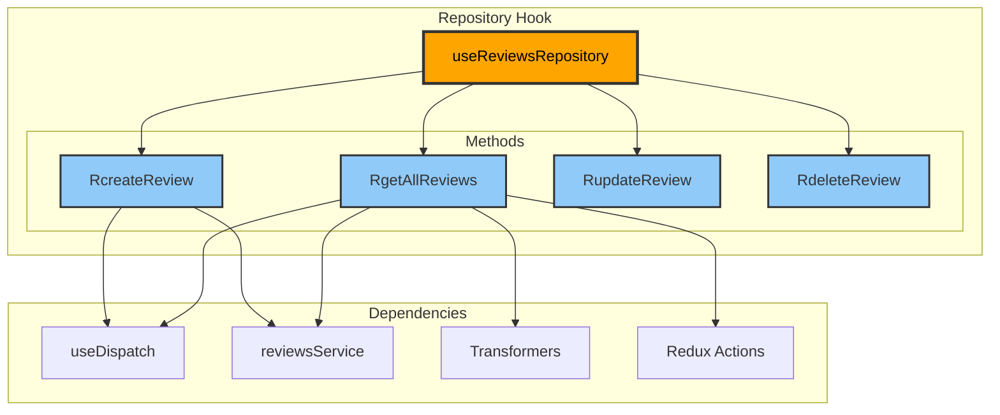
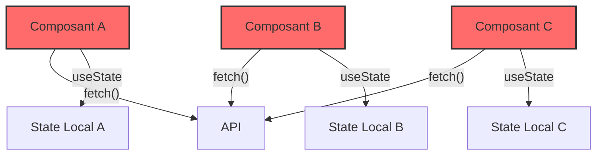
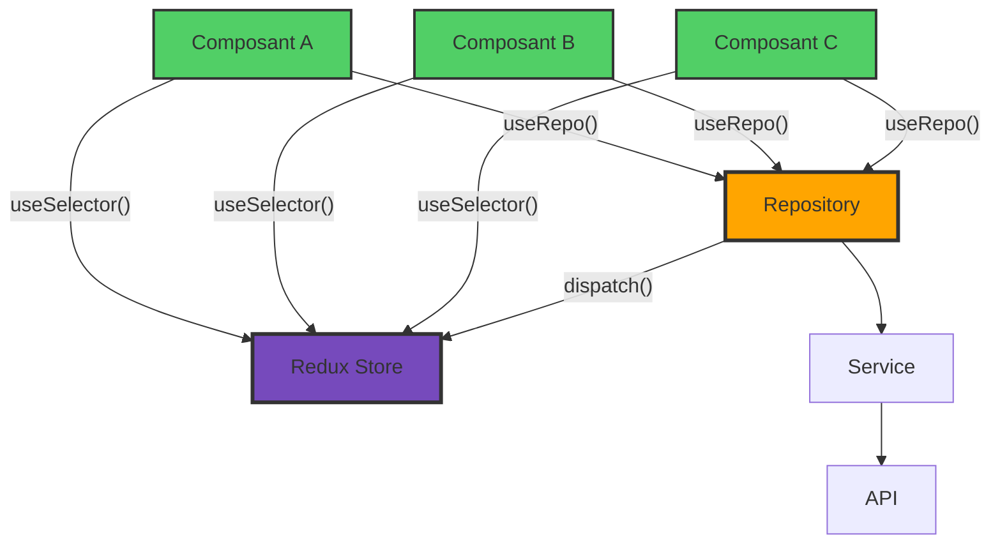
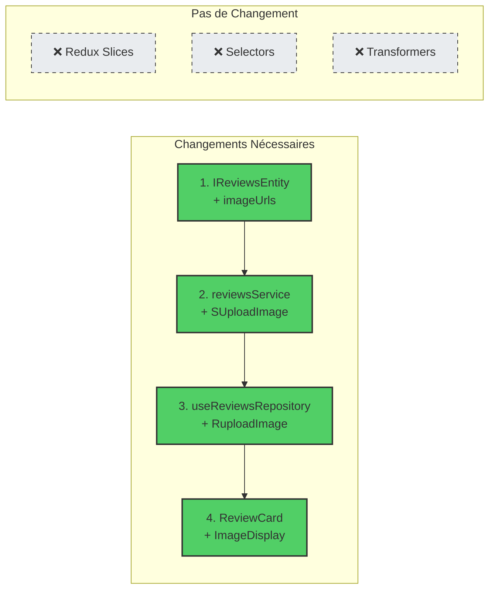
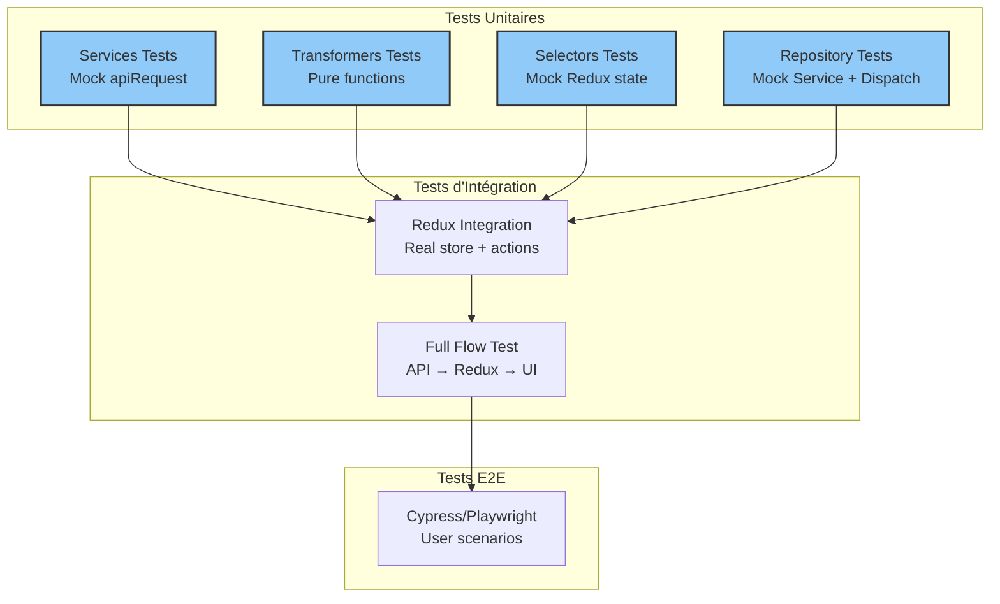
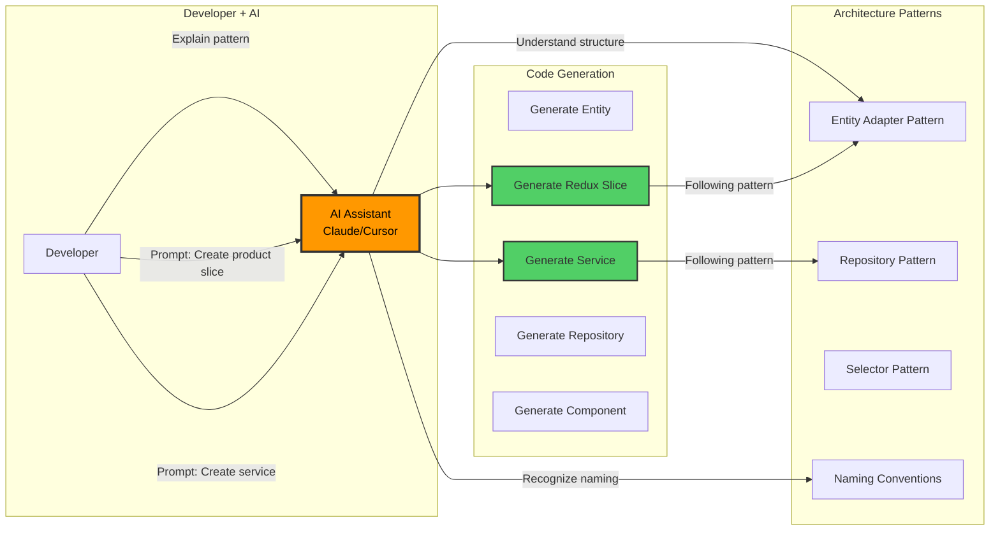

# 🏗️ Diagrammes d'Architecture

Ce document contient tous les diagrammes pour comprendre l'architecture du projet.

---

## 1. Vue d'Ensemble : Architecture en Couches



---

## 2. Flux de Données : GET All Reviews



**Points clés :**
1. Le composant ne connaît pas la structure de l'API
2. Le transformer normalise les données avant Redux
3. Le selector dénormalise pour l'UI
4. Chaque couche a une responsabilité unique

---

## 3. Structure Redux : Normalisation



**Avantages de la normalisation :**
- ✅ Pas de duplication de données
- ✅ Une review modifiée se met à jour partout automatiquement
- ✅ Performance optimale (lookup en O(1))

---

## 4. Flux de Création : CREATE Review



**Note :** Pas besoin de normalisation ici car c'est une seule entité.

---

## 5. Pattern Repository : Orchestration



**Le Repository est le chef d'orchestre :**
- Coordonne Services + Redux
- Transforme les données
- Centralise la logique métier
- Interface stable pour les composants

---

## 6. Selector Pattern : Dénormalisation avec Memoization

```mermaid
graph TB
    subgraph "Redux State (Normalisé)"
        STATE_REVIEWS[reviews.entities<br/>{1: {id:1, ...}, 2: {id:2, ...}}]
        STATE_IND[indicators.entities<br/>{0: {reviewIds: [1]}, ...}]
        STATE_REPORT[report.entities<br/>{0: {reviewIds: [1,2], ...}}]
    end

    subgraph "Selectors (avec createSelector)"
        SEL1[selectDenormalizedReviews]
        SEL2[selectDenormalizedIndicators]
        SEL3[selectDenormalizedReport]
    end

    subgraph "Output pour Composants (Dénormalisé)"
        OUT_REVIEWS[Array de Reviews]
        OUT_IND[Indicators avec reviewsList complètes]
        OUT_REPORT[Report complet]
    end

    STATE_REVIEWS --> SEL1
    SEL1 --> OUT_REVIEWS

    STATE_IND --> SEL2
    OUT_REVIEWS --> SEL2
    SEL2 --> OUT_IND

    STATE_REPORT --> SEL3
    OUT_REVIEWS --> SEL3
    OUT_IND --> SEL3
    SEL3 --> OUT_REPORT

    style SEL1 fill:#ffeb3b,stroke:#333,stroke-width:2px
    style SEL2 fill:#ffeb3b,stroke:#333,stroke-width:2px
    style SEL3 fill:#ffeb3b,stroke:#333,stroke-width:2px
```

**Memoization avec createSelector :**
- Ne recalcule que si les inputs changent
- Cache le résultat précédent
- Évite les re-renders inutiles
- Performance optimale

---

## 7. Comparaison : Avec vs Sans Architecture

### Sans Architecture (Anti-pattern)



**Problèmes :**
- ❌ Logique dupliquée dans chaque composant
- ❌ State désynchronisé entre composants
- ❌ Impossible à tester
- ❌ Appels API non optimisés

### Avec Architecture (Bon Pattern)



**Avantages :**
- ✅ Logique centralisée (1 seul endroit)
- ✅ State synchronisé automatiquement
- ✅ Facile à tester (mock le repo)
- ✅ Appels API optimisés (cache Redux)

---

## 8. Évolution MVP : Ajout de Feature

**Exemple : Ajouter des images aux reviews**



**Total : 4 fichiers modifiés, ~80 lignes ajoutées**

vs

**Sans architecture : 15+ fichiers, ~450 lignes modifiées**

---

## 9. Testing Strategy



**Testabilité excellente :**
- Chaque couche testable indépendamment
- Mocks simples et clairs
- Tests rapides à exécuter

---

## 10. AI-Assisted Development



**L'IA est boostée par l'architecture :**
- Patterns consistants → Génération fiable
- Naming cohérent → Compréhension rapide
- Code commenté → Context pour l'IA
- Résultat : 10x plus rapide avec l'IA

---

## Conclusion

Ces diagrammes illustrent comment chaque couche de l'architecture collabore pour :
- ✅ Séparer les responsabilités
- ✅ Maintenir la cohérence des données
- ✅ Optimiser les performances
- ✅ Faciliter les tests
- ✅ Accélérer les itérations

**L'architecture n'est pas de la complexité inutile, c'est de la simplicité organisée.**
